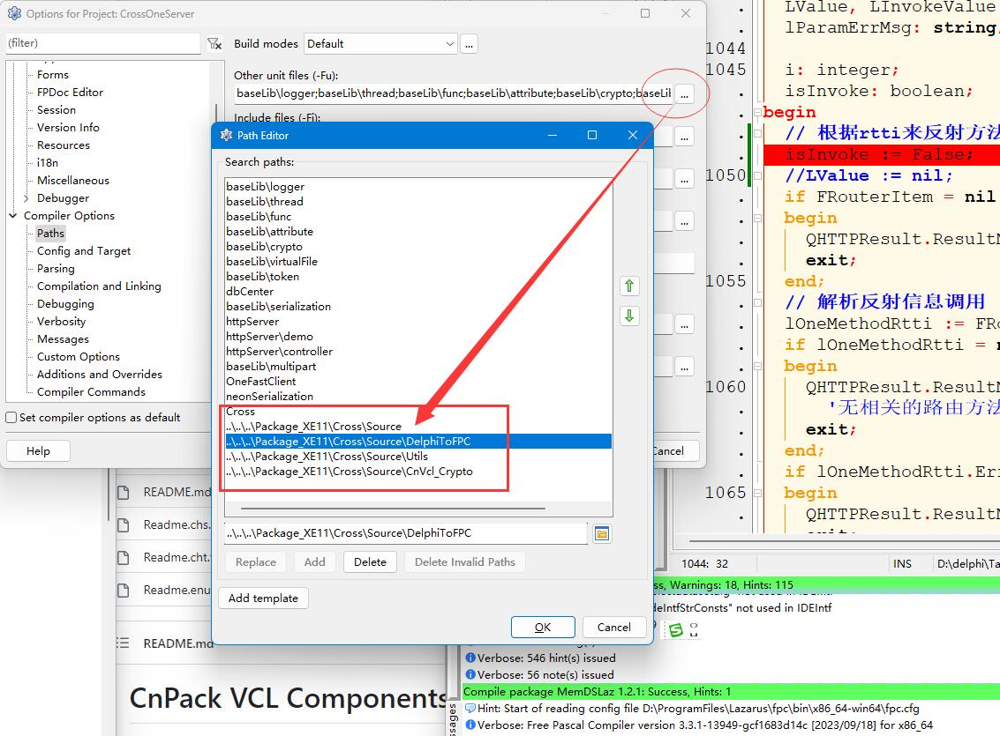
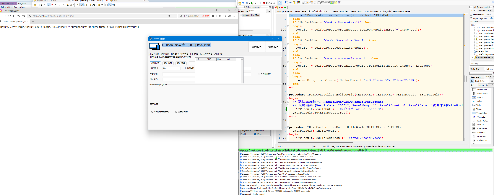

所需文件:

1.最新版的Delphi-Cross-Socket下载地址:

开源地址: https://github.com/winddriver/Delphi-Cross-Socket

2.最新版的mORMot2 
开源地址: https://github.com/synopse/mORMot2 

注意： static目录里的文件需要单独下载

 https://synopse.info/files/mormot2static.7z

3.cnpack开源地址: https://github.com/cnpack/cnvcl

4.以下文件在CnVcl_Crypto有打包,也可自行到cnpack或相关网站下载

zLib.inc /zlib1.dll/CnPack.inc

5.需配置路径

