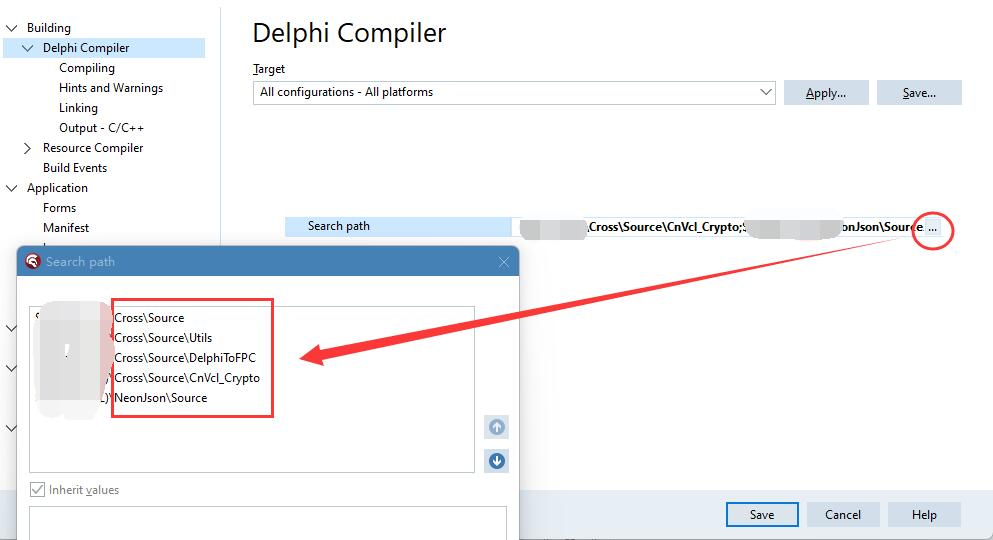
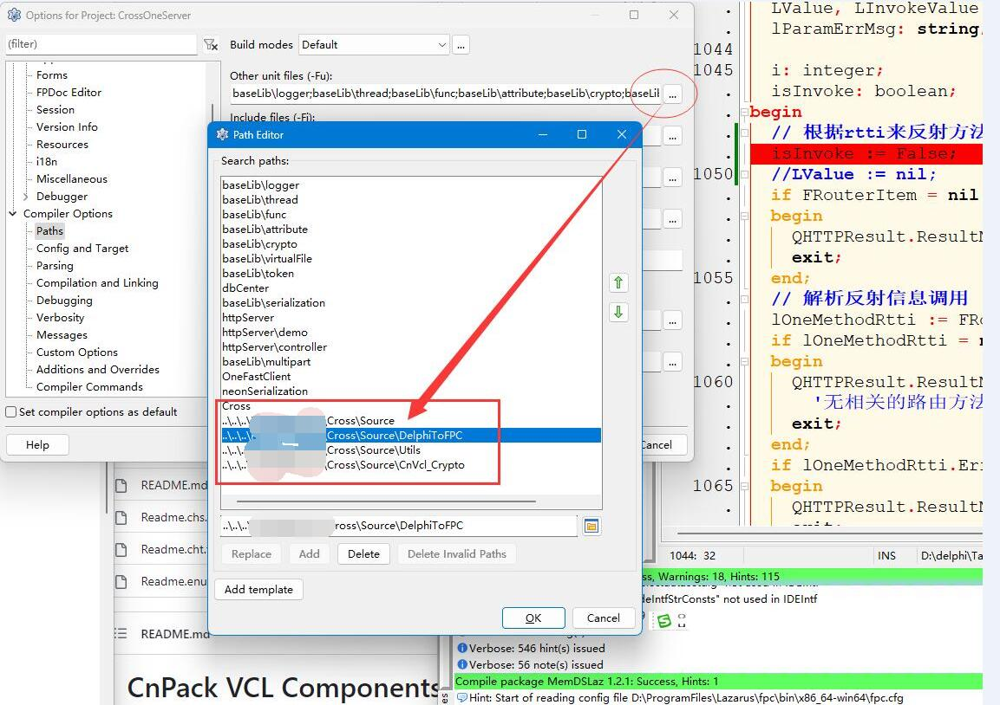

# OnePascal: 支持最新版的delphi-Cross-Socket(2023.10.03)

 ** OnePascal 简介(开源/免费/全源码)**  
=========================================================

**OnePascal是叫兽(FLM)QQ:378464060 开发的三层中间件，

基于Delphi/Lazarus/HBuilderX/等IDE

支持MVC及传统DataSet框架，使用的是Mormot2的HTTP通讯**  

Delphi版本:    OneDelphi  包括OneServer/OneClient/ClientDemo/OneFastClient

Lazarus版本:   OneLaz     包括OneServer/OneClient/ClientDemo

HBuilderX版本: OneUniAPP  对接OneDelphi/OneLaz服务端中间件

=========================================================

#### 本仓库基于OnePascal弃用mormot2通讯库,采用最新版的Delphi-Cross-Socket通讯库(2023.10.03) 

 **修改人:CCC  ** 

Delphi版本:    OneDelphi已支持最新版delphi-Cross-Socket

Lazarus版本:   OneLaz已支持最新版delphi-Cross-Socket

开发环境:Windows 11 22H2/AMD   DX11  laz V3.99  fpc V3.3.1

####开发工具简介：

[Delphi IDE:](https://www.embarcadero.com/cn/products/delphi/starter)
请支持正版开发工具或者[社区免费版](https://www.embarcadero.com/cn/products/delphi/starter)。
https://www.embarcadero.com/cn/products/delphi/starter

[Lazarus IDE:](https://www.lazarus-ide.org/)
https://www.lazarus-ide.org/

[Hbuilderx IDE:](https://www.dcloud.io/hbuilderx.html)
https://www.dcloud.io/hbuilderx.html

#### 使用方法(最新版需手动配置Cross目录和cnVcl_Crypto目录,请自行指定,下载cnVcl_Crypto.rar或去cnpack下载):
=========================================================

1.方法一:使用这三个文件替换onedelphi/onelaz 中的同名文件

2.方法二: onedelphi/onelaz项目,右键查看源码,把下面三个文件的路径配置正确即可

  OneWebSocketServer in 'Cross\OneWebSocketServer.pas',

  OneHttpServer in 'Cross\OneHttpServer.pas',

  OneHttpCtxtResult in 'Cross\OneHttpCtxtResult.pas',

3.方法三:把CrossOneServer.dpr和Cross文件档夹到OneServer同级

4.最新版Cross-Socket需配置路径(delphi和lazarus).
下载cnVcl_Crypto.rar或去cnpack下载

#### 开源组件地址
=========================================================

 **Delphi-Cross-Socket开源地址:** 
https://github.com/winddriver/Delphi-Cross-Socket

 **mORMot2 开源地址:** 
https://github.com/synopse/mORMot2 
注意： static目录里的文件需要单独下载
https://synopse.info/files/mormot2static.7z

 **cnpack开源地址:** 
https://github.com/cnpack/cnvcl

 **群友OneDelphi地址:** 
https://github.com/xenli/OneDelphi

 

#### Gitee 特技
===================================================================

1.  使用 Readme\_XXX.md 来支持不同的语言，例如 Readme\_en.md, Readme\_zh.md
2.  Gitee 官方博客 [blog.gitee.com](https://blog.gitee.com)
3.  你可以 [https://gitee.com/explore](https://gitee.com/explore) 这个地址来了解 Gitee 上的优秀开源项目
4.  [GVP](https://gitee.com/gvp) 全称是 Gitee 最有价值开源项目，是综合评定出的优秀开源项目
5.  Gitee 官方提供的使用手册 [https://gitee.com/help](https://gitee.com/help)
6.  Gitee 封面人物是一档用来展示 Gitee 会员风采的栏目 [https://gitee.com/gitee-stars/](https://gitee.com/gitee-stars/)
代码仅供学习使用
